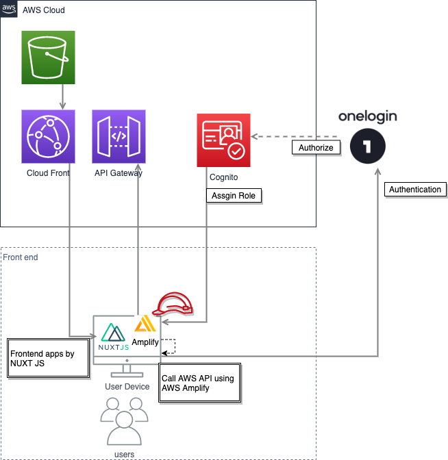

# tokyo-airticket-management-ui

航空券管理コンソールのフロントエンド


## Architecture



使用フレームワーク

- [nuxtjs](https://github.com/nuxt/nuxt.js)
- [Vuetify](https://vuetifyjs.com/en/)
- [amplify](https://aws-amplify.github.io/docs/js/api)


### フロントエンド

- フロントエンドフレームワークに[nuxtjs](https://github.com/nuxt/nuxt.js)を採用し、awsとの連携に[amplify](https://aws-amplify.github.io/docs/js/api)を使用しております。
- ui フレームワークに  [Vuetify](https://vuetifyjs.com/en/)を採用しております。

### 認証

- oneloginにて認証を行い、cognitoでroleを割り当て権限付与しております。


## Build Setup

``` bash
# install dependencies
$ npm i

# serve with hot reload at localhost:3000
$ npm run dev

# build for production and launch server
$ npm run build
$ npm start

# generate static project
$ npm run generate
```


## Deploy

- 開発環境へデプロイ

```bash
bin/deploy.sh
```


## Validate in form

- Npm I vee-validate
- Link: https://viblo.asia/p/tim-hieu-nuxt-phan-1-QpmlewjVKrd
